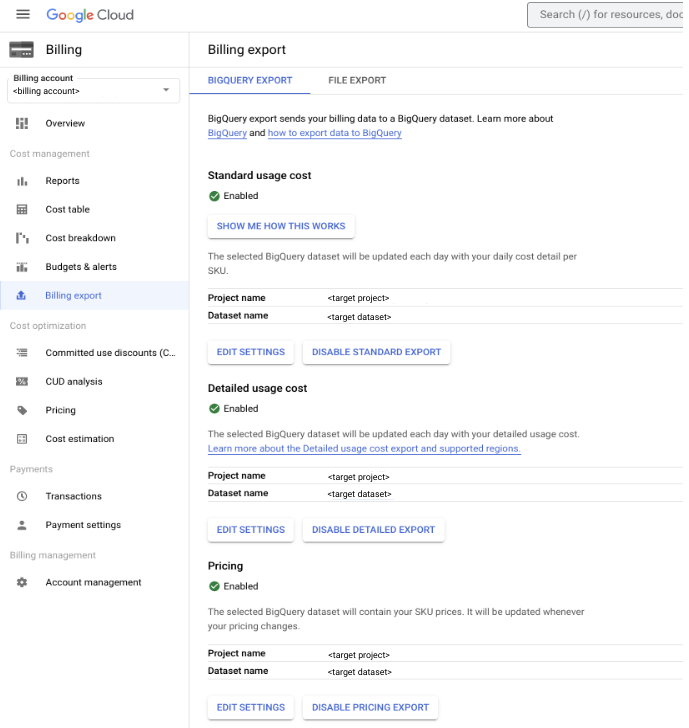
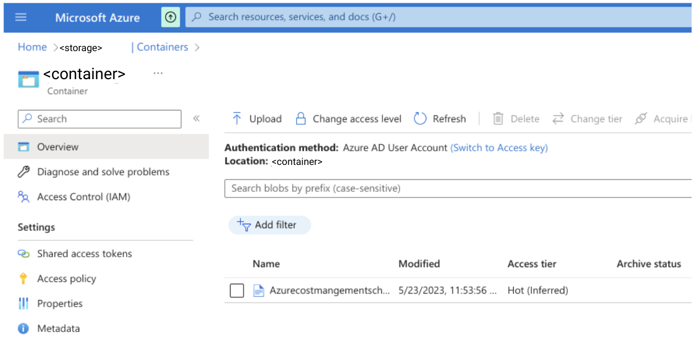
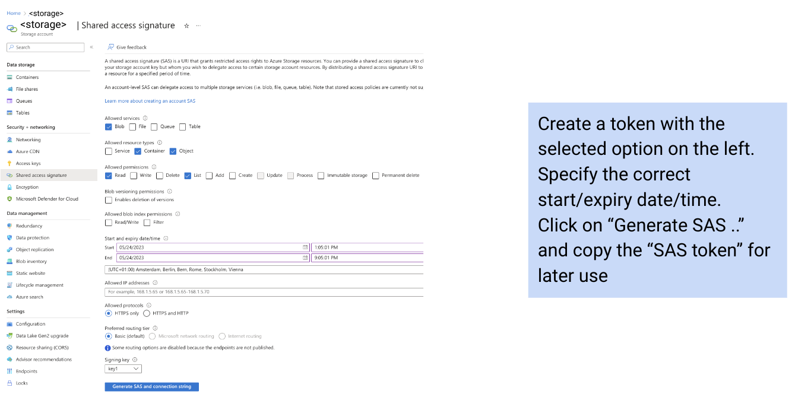
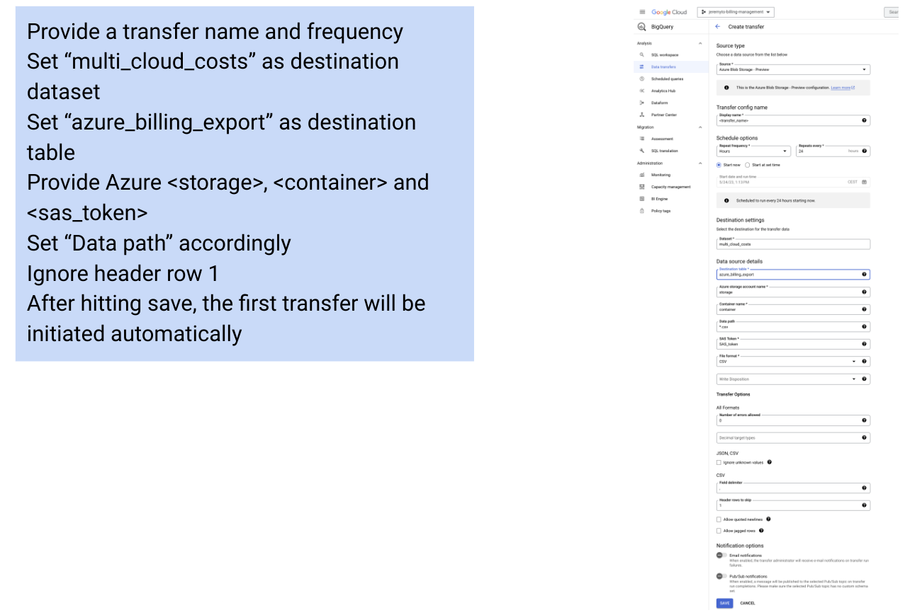

# Multi-cloud cost mapping


## Project structure
```
.
|-- README.md
|-- cloudbuild.yaml
|-- cloudfunctions.tf
|-- cmds.txt
|-- config.tf
|-- deploy.sh
|-- gar.tf
|-- iam.tf
|-- install.sh
|-- multiplyrun
|   |-- Dockerfile
|   `-- app.py
|-- randomgen
|   |-- 2d9cab30_randomgen.zip
|   |-- cloudfunction.tf
|   |-- main.py
|   |-- requirements.txt
|   `-- vars.tf
|-- terraform.tfstate
|-- terraform.tfstate.backup
|-- terraform.tfvars.json
|-- vars.tf
`-- workflow.tf

```


## Setup

1. Find out your GCP project's id and number from the dashboard in the cloud console, and update the following variables in the `terraform.tfvars.json` file. Replace `YOUR_PROJECT_NMR`, `YOUR_PROJECT_ID` and `YOUR_PROJECT_REGION` with the correct values. 


```shell
{
    "project_id": "YOUR_PROJECT_ID",
    "project_nmr": YOUR_PROJECT_NMR,
    "project_default_region": "YOUR_PROJECT_REGION",
    "billing_export_dataset": "YOUR_BILLING_EXPORT_DATASET",
    "billing_export_project_id": "YOUR_BILLING_EXPORT_PROJECT_ID",
    "billing_export_dataset_id": "YOUR_BILLING_EXPORT_DATASET",
    "billing_export_dataset_region": "YOUR_BILLING_EXPORT_DATASET_REGION"
}
```

## Install

1. Run the following command at the root of the folder:
```shell 
$ sudo ./install.sh
$ terraform init
$ terraform plan
$ terraform apply
```

> Note: You may have to run `terraform plan` and `terraform apply` twice if you get errors for serviceaccounts not found

2. Setup GCP billing export to BigQuery in the same project, under the dataset `billing_exports`:



3. Setup AZR billinmg export to a storage container:



4. Create a SAS token authorised access:



5. Create a Data Transfer in BigQuery:



6. Install the different `blocks` in Looker, and update the blocks configurations to point to your project/dataset
